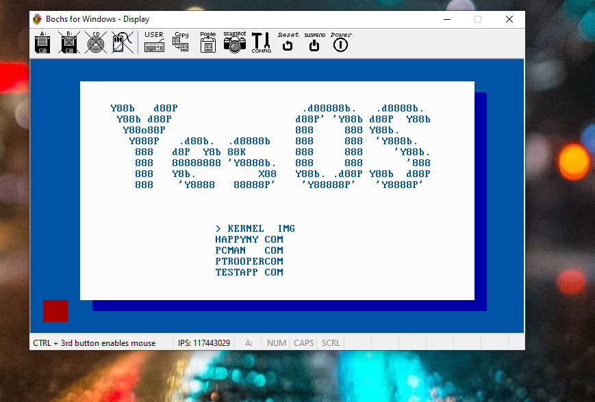
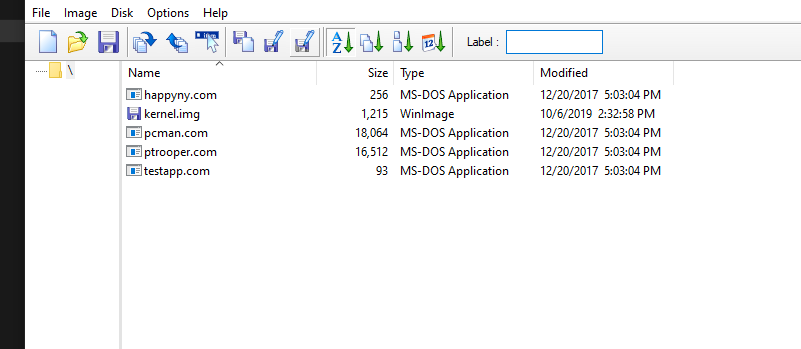

# YesOS

**YesOS** is a real mode x86 operation system with a bootloader, a kernel and a simple gui which can run dos-comparable programs.

I started this project to improve my asm skills, so it is written only in asm language

## How to run

Just take some virtual machine (e.g. VirtualBox or bochs), insert _build.img_ as a floppy disk and enjoy ;)

If you want to insert your games/dos programs, you need to insert files into _floppy.img_ ([I used this program](http://www.winimage.com/)) and recompile _build.asm_ with
[FASM compiler](https://flatassembler.net/).

## Some technical info

- Written with [FASM assembly](https://flatassembler.net/)
- It's fully compatible with FAT12, so even modern OS can read it
- Unfortunately, i did not implement dos functions, so not every program can work correctly

## Contact

If you have any questions about this project, I will be happy to help you to understand the basic concepts of
Operating systems.

- Email: and.yushkevich@gmail.com
- Telegram: @qunapi
